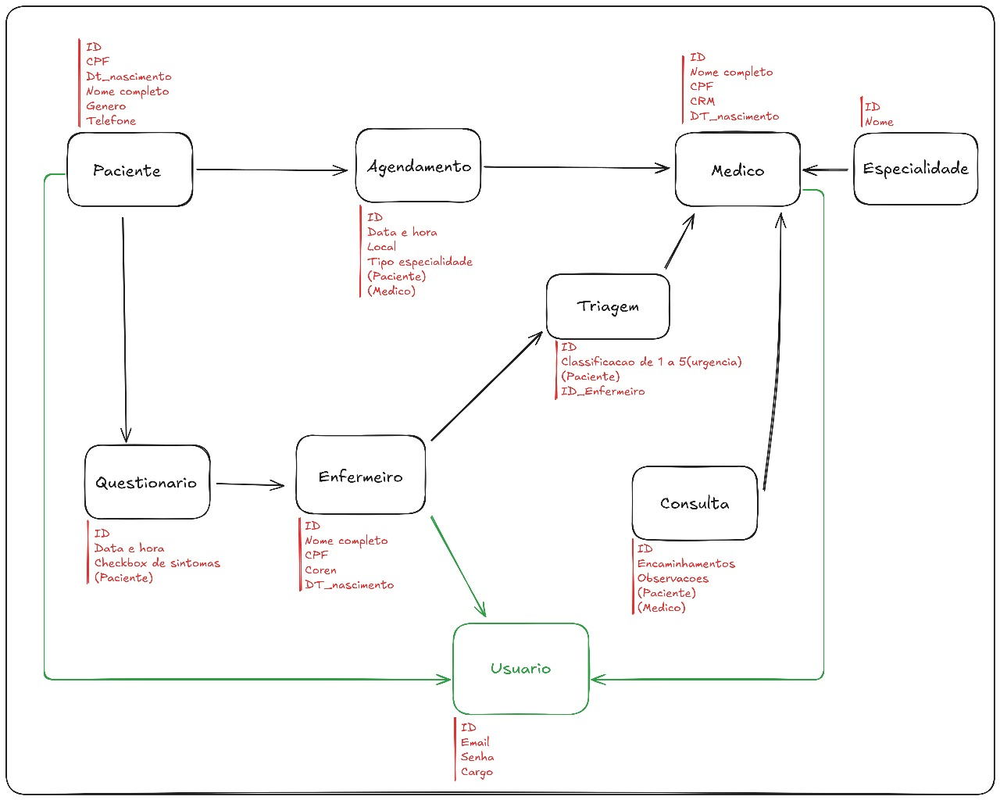

# MediTriagem 🩵🩺💻
**Trabalho para a Disciplina de Back-End: Web Services do curso de Sistema de Informação**

Período: **4º** -	Turma: **B**	-    Turno:	Noturno

Integrantes:
* Adrian Antônio de Souza Gomes;
* Bruna da Silva Carnelossi;
* João Pedro de Souza Quintiliano da Silva;
* Lucas Azzolin Haubmann.

-----

Definição do Sistema: MediTriagem é um sistema destinado a gerenciamento de hospitais e pronto-socorros, é um sistema que disponibiliza o usuário (paciente) a realizar sua pré-triagem inicial de maneira rápida e fácil o qual consiste em um questionário interativo que avaliará os sintomas do paciente e determinará o nível de gravidade do mesmo (este podendo ser nível de prioridade vermelho, laranja, amarelo ou verde)

**Ferramentas:**
- Linguagem: Java Spring Boot;
- Banco de Dados: MySQL;
- Mecanismos de Autenticação: JWT
 
-----
Logomarca:

 

Fluxograma básico do Projeto:

------

Referências: 
https://mv.com.br/blog/triagem-hospitalar